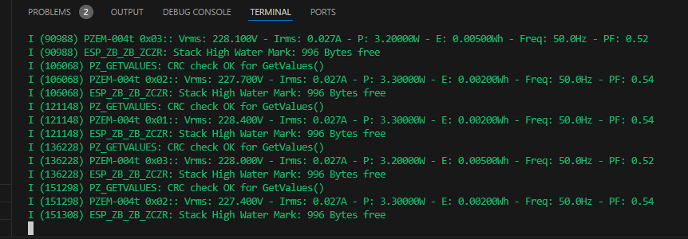

| Supported Targets | ESP32-H2 | ESP32-C6 |
| ----------------- | -------- | -------- |
# PZEM-004T v3.0 ESP-IDF Library  
https://github.com/wernervanmele/esp-idf-pzem004tv3?tab=readme-ov-file

# esp-zigbee-sdk
https://github.com/espressif/esp-zigbee-sdk/tree/main/examples/esp_zigbee_HA_sample/HA_temperature_sensor
https://github.com/espressif/esp-zigbee-sdk/tree/main/examples/esp_zigbee_HA_sample/HA_thermostat

    

